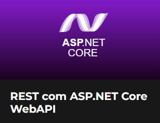

<h1 align="center">
:small_red_triangle_down: Web REST API with ASP.NET Core  
</h1>

  

<h2 align="center">
Web REST API with ASP.NET MVC Core by <b>Desenvolvedor.io</b>
</h2>

  

This repository was created as part of course "Web REST API with ASP.NET Core" by <b>Desenvolvedor.io</b> and it's purpose is building a full API with ASP.NET Core Application with modern, secure and clean code. This is a back-end to an app created in another course (MVC App) which is about a system of Suppliers and Products with Identity authentication, documented with Swagger, monitoring with Elmah.io and deploy on Azure.

  

